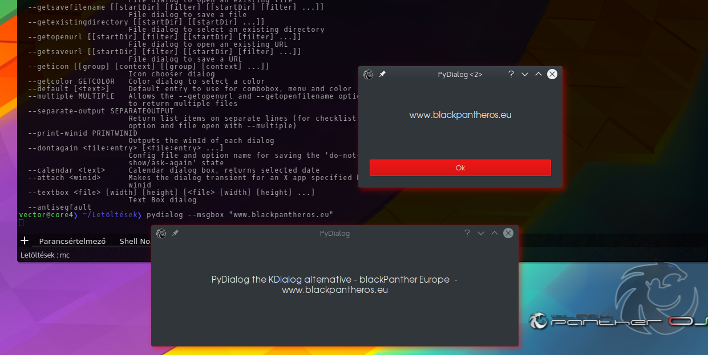

Description: 
------------

My problem was that the kdialog code is still not ported to Qt5 and it depends on various Qt4/KDE4 components. 
The kdialog has big dependency sizes so we made an alternate dialogs like kdialog switches, options. 
We would still like full compatibility with kdialog but a few options are still not finished and although this release provides many important functions.

Patches, Extensions, any ideas are welcome!

Screenshot
-----------

 

Plans:
------
- Dialogs still in focus (optional/default)
- License dialog intagration
- Full compatible for replace /or with --kdialog option/ with kdialog

Working dialogs/options:
------------------------
- 90% compatiblility with kdialog
- easy gui for PackageKit install/uninstall
- many other exended options: example: settings button, expendables details, etc.

Please run to print available options: pydialog --help
